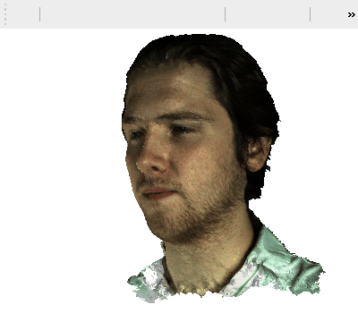

# drone-rl
Frontal Face Tracking for Drones using Deep Reinforcement Learning

# Overview

- Deep Q Learning

- Input: A frame of camera pointed at the head

-> Image: 64x64x3 (Pixels x Pixels x RGB)

- Output: Action the drone has to take in order to arrive in front of the face

-> Up / Down / Left / Right

## Environment:

Mayavi:

3D model with the ability to rotate to all directions within a 180 degree angle horizontaly and 120 degree angle vertically.

This environment has a big real-time rendering cost for a standard desktop computer so a dataset of 21.600 frames of different angles has been created for offline-training. This of course leads to a much faster training process since there is no actual real-time rendering taking place.

## Reward Function:

horizontal reward = (horizontal degree / 90 - 1 )^2
vertical reward = (vertical degree / 60 - 1 )^2

total reward = (horizontal reward + vertical reward) / 2

This lead to a slow convergence since changing one angle at a time didn't provide too much motive. To tackle this, a *boosting* reward was introduced, working similarly to momentum [] . If the previous action taken was in the right direction (positive feedback) then 

motivation = (reward - previous reward) * (1 - reward)

total reward = total reward + motivation

## Deep Reinforcement Learning

### Deep Q Learning Agent

### Experience Replay

Save the following information of a run:
- previous position of the face
- the action of the agent
- the reward of the agent
- current position of the face

Based on these runs, calculate the targets of the agent:
1. Pick random runs from memory
2. Calculate Q-values (possible rewards of next movements) with the Neural Net
3. Calculate the values of the targets based on the reward of that action and the max Q-value

- Discount factor (gamma): Control how much influence the memory has on the next action.
A small discount value (0.1) will lead to a greedy agent that seeks the maximum reward in the next step
A big discount value (0.9) will lead to a long-sighted agent that trusts its memory

## Neural Net

- Input: 64x64x3 image
- 3 Hidden Layers with ReLU activation
- Output layer with 5 nodes / possible actions: Up, Down, Left, Right, Stay

- Adam Optimizer + MSE loss

# Referneces

Keras-rl https://github.com/keras-rl/keras-rl
